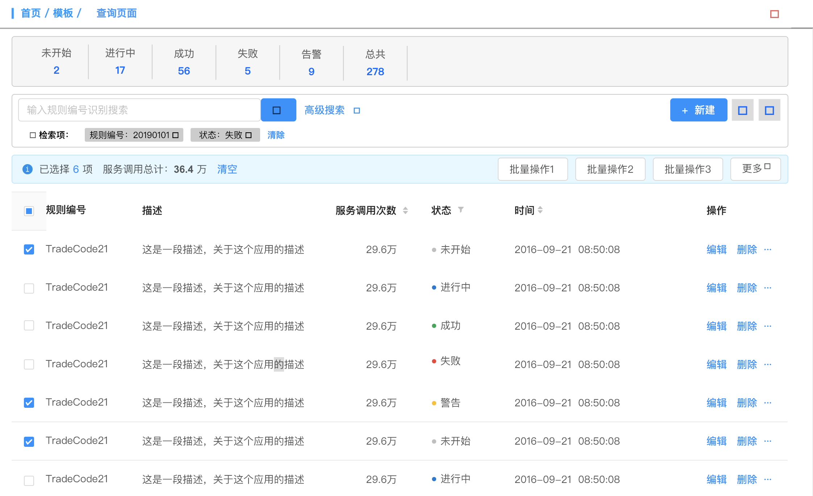

# 查询页面



每次 修改 都要发送两个请求
* 上边部分 获取符合匹配项 的 全量数据

* 符合匹配项 的 分页数据

### 上面部分的 展示模块

1. 是完全动态渲染的, 不设定一个几项 (mock 结构)
2. 如果 返回数据 缺失 或者 错误. 缺省方案为： 只显示一个 “总共” 是否合适？
3. 制作后， 显示样式将是 flex 等分样式. 不设置 单个项的 宽度
4. 支持 点击效果 => 也就是再次 发起一次 搜索请求
5. 优化项： 将给 数量 添加 增量动画 (需调研测试, 优先级不高)

### 中间部分 搜索模块

1. 输入框 默认为 “编号索索” === 也就是检索 id + (新增) 一个 "状态" 筛选功能
2. 高级搜索 按钮 点击后， 显示 隐藏的多个搜索输入框 (done), 这些输入框都是 动态生成
3. 如果 返回结果中 发生错误 没有 高级搜索配置。 缺省显示： 提示文字 “本页无高级搜索”
4. 右侧 一个 “新建” 按钮， 但是不做 具体反馈
5. “检索项” 内容是 动态生成, 并且使用 tag 来做. 后面带有一个 清除按钮 (功能 优先级 2)
6. 支持 “批量操作”

### 下部分 demo 表格模块
1. 表头，动态生成的； 但是必有的项： 编号， 描述， 状态， 操作 (不做具体功能， 只放一个按钮即可)
2. 根据 搜索请求后 的得到的结果 props 进行渲染
3. 接受 loading 状态
4. 放开一个 回调函数， 放给 表格“状态筛选” 调用

## model 部分

```js
interface ServiceParams {
  type?: 0 | 1 // 0就是分页参数生效, 为1分页参数不生效
  orders?: {
    name: 'orders'
    type: 'desc' | 'asc'
  }
  pagination?: {
    total?: number // 0
    current: number // 1
    pageSize: number // 10
  }
  query: QueryType
}

export interface QueryInitState extends ServiceParams {
  totalStatus: TotalStateItem[]
  queryTags: TotalStateItem[]
  queryParams: QueryParamsItem[]
  data: any
  statusActive: string
}

state: {
  totalStatus: TotalStateItem[],
  queryParams: QueryParamsItem[],
  queryTabs: ;string[],
  data: any[],
  batchOp: any[],                               // 批量操作
  itemOp: any,                                  // ?
}
```
* 请求 - fetch
* 新增 - create
* 删除 - delete
* 更新 - update
* 配置参数 - setParams
* 配置 '检索项' - 是否需要
* 批量操作 (数组)
* 单个对象操作 (对象) - 是否需要

测试操作内容:
1. 点击 '状态'按钮: 配置参数 -> 请求
2. 输入 “ID” (简单搜索) 点击 '搜索': 配置参数 -> 请求 -> 配置'检索项'
3. '高级搜索', 输入配置项, 点击 '搜索': 配置参数 -> 请求 -> 配置'检索项'
4. 点击 '检索项'的 删除按钮, 触发自动 更新: 配置参数 -> 请求 -> 配置 '检索项'
5. 点击 '检索项'的 清除按钮, 触发自动 更新: 配置参数 -> 请求 -> 配置 '检索项'
6. 点击 '新建', 配置完成后, 再点击 '添加': 配置 操作对象 => '新增'接口 => 请求 (更新列表)
7. 点击 ‘编辑(更新)’, 配置完成后, 再点击 '更新': 配置 操作对象 => '更新'接口 => 请求 (更新列表)
8. 批量操作 等功能: 配置 '批量操作' 数组 => '批量操作' 接口 => 请求 (更新列表)

## TODO
* 分页 - done
* 排序条件 - done
* 新增 排序 & 分页 参数 - done
* models/ => model.ts - done
* 测试 接口错误时, 页面反馈 - done
* 当 totalStatus 为空时 渲染 '全量'一个 - done
* query 统一约束 请求时的 params 参数格式, 配置 types - done
* 在接口交互时, 将 query 通过方法做一次包装, 转换为 后端需要的格式 - done
* 
* 对 提交的参数做 qs 转 string - error, 需要调研
* 
* 批量操作 用JSON 配置还是 放开一个 接口 渲染 config 写好的 组件 model 合并
* query string params 问题, 参数层级问题
* closeTag: dispatch 操作 tag, 发起请求?
* types 优化
* add 添加操作 & 新增 mock接口
* update 更新操作 & 更新 mock接口
* 搜索 操作: 设置 query 参数, 然后请求
